## Software testing

### What is testing?
Testing is the process of executing a program with the intnt of finding errors.
Es un conjuntos de activiades sistematicas para encontrar errores que hemos hecho sin querer, cuando es diseño o construido

### Basic definitions
ISTQB: Internatinal Software Testing Qualification Board

- Error: en el codigo lo llamamos bugs
- Fault: una fualt es resultado de un error, es la representacion de un error
  - Commision: we enter something into a representation that is incorrect (hacemos algo incorrecto)
  - Omission: we failt to enter correct information that should have been present in the representation, but is missing (se nos paso por alto), lo que esta mal en codigo
- Failure: courre cuando el codigo correpsondiente da un fault, ejecucion de loq ue est amal ene codigo
- Incident: un incidente es el sinonimo asociado con el fialure, alerta al usuario que ha ocurrido un fialure
- Test: is el acto de ejecutar software con casos de prueba, puede tener dos objectivos, encontrar failures o demotrar correcto funcionamiento
- Test case: tiene una identidad y esta asociedado con el comportamiento del programa, tiene un conjunto de inputs y outputs experados.

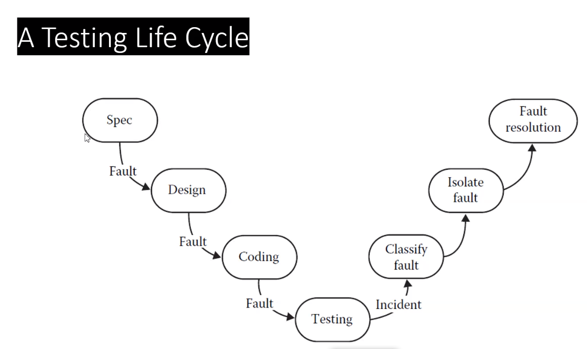

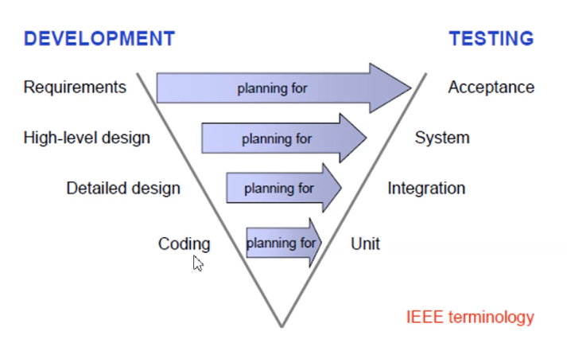

- Unit testing: test para compnetes individuales, una clse, algun metodo etc
- Integration testing, es donde combinamos los test individuales son combinados en un grupo (componentes, comprobamos compatiblidad de inputs y outputs)
- System testing: es donde todo el system es testeado para verificar que los requerimientos se cumplen
- Acceptence testing: es donde el software es testeado para aceptabilidad (hardwware, sfoware and connectivity)

### Test cases
A test case is (or should be) a recognized work producto
Contiene:
- a id
- una breve proposito
- descipcion, precondiciones
- test case inputs
- los outputs esperados
- una descripcion de los epserados postconditions
- un historial de ejecution

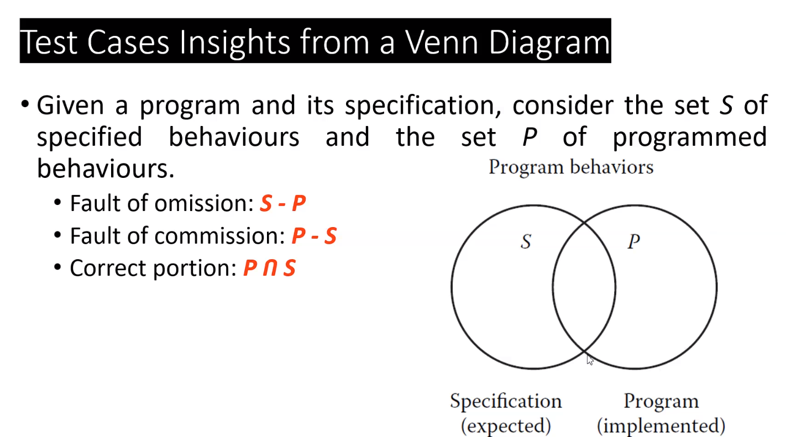

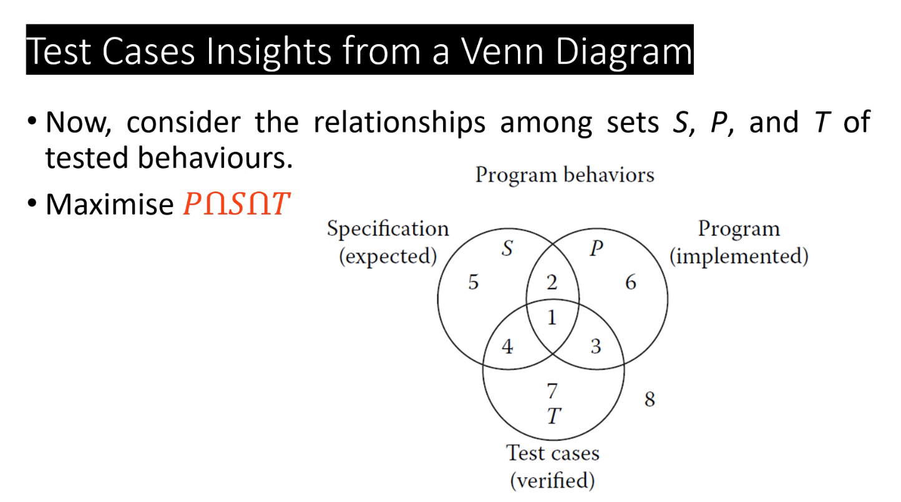

### Fault Taxonomies

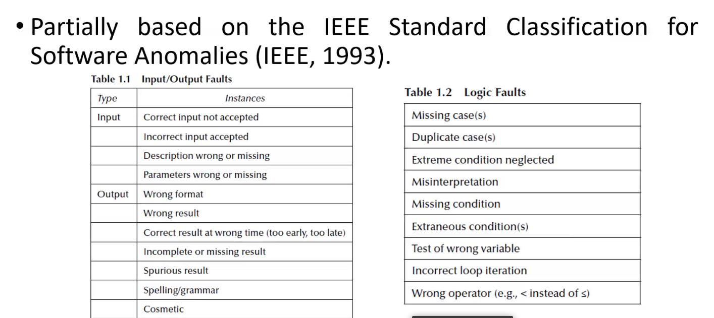

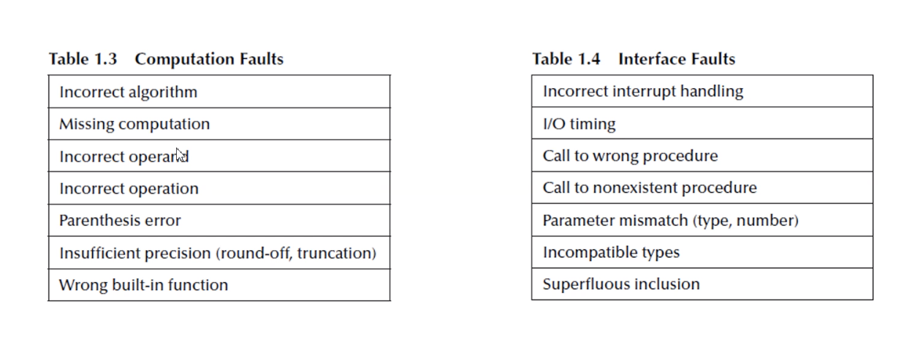

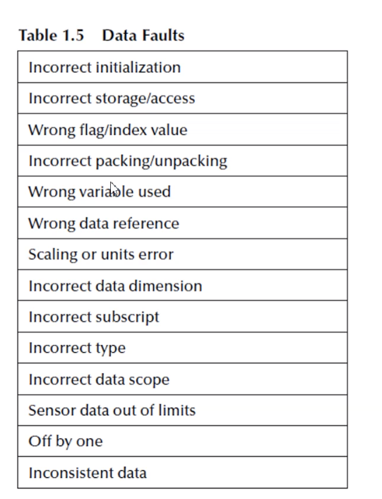

## Cracterisitcas de buenos tests case

### Problem
- no podemos probar para todo
- no system can be completely tested
- the need to have a clever testing methodology

### Solutions
- prioritazacion de test basados en analisis de riegos
  - cual es el test mas importante
  - que bugs hayq ue encontrar primero
- el test debe ser cuidadosamente diseñado

- alta probabilidad de encontrar un erorr
- no redundante
- should be "best of breed
- should be neither too simple not too complex

## Approach to test cases identitication

- conociento la function esepcificada que un producto ha sido diseñada (concepto de caja negra) Function testing
- conociento el trabajo interno de un producto (caja blanca) Strcutural testing

## Function testing
Llamadas specification-based
Todo programa puede ser considerado comouna function that mapea valores desde su input dominio a su rango de salida
Probamos que valores de entrada producen errores

Categorias:
- incorrectas o fucntiones faltnates
- errores de interface
- erroes en la estrucutra de data o external database access
- comportamiento o errores de rendimiento
- errores de inicializacion o terminacion

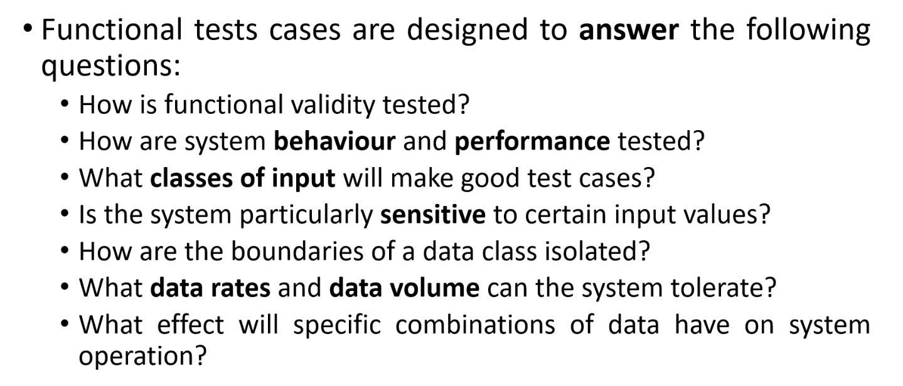

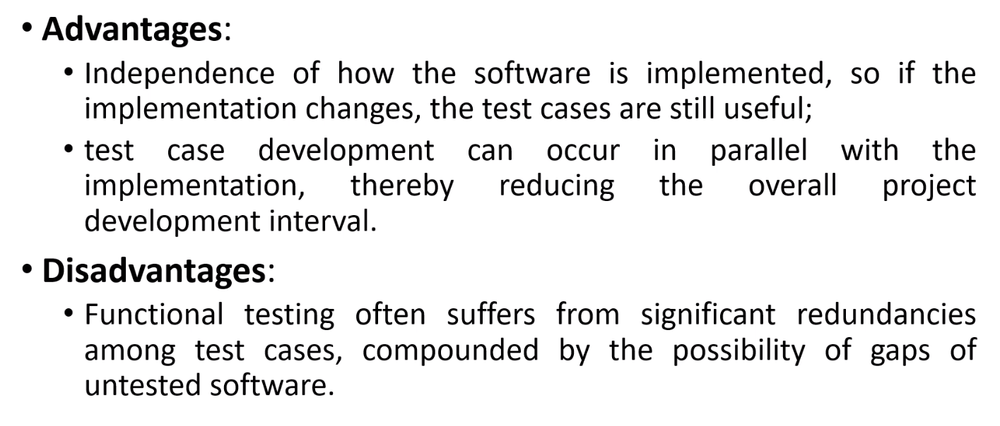

## Strcutural testing
White box, internal

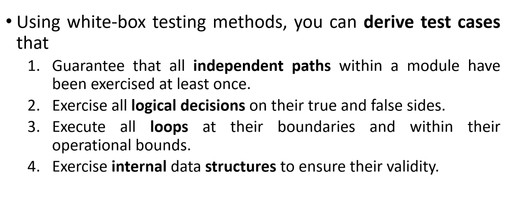

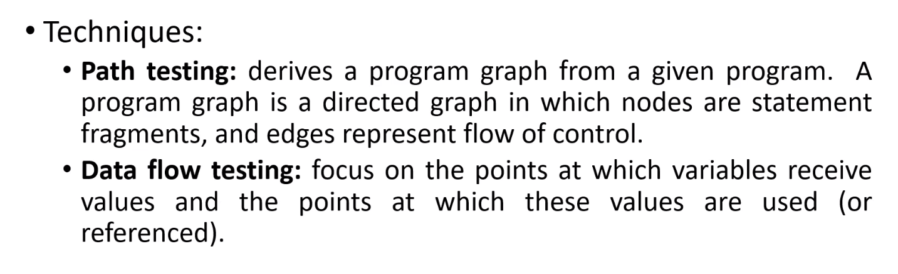

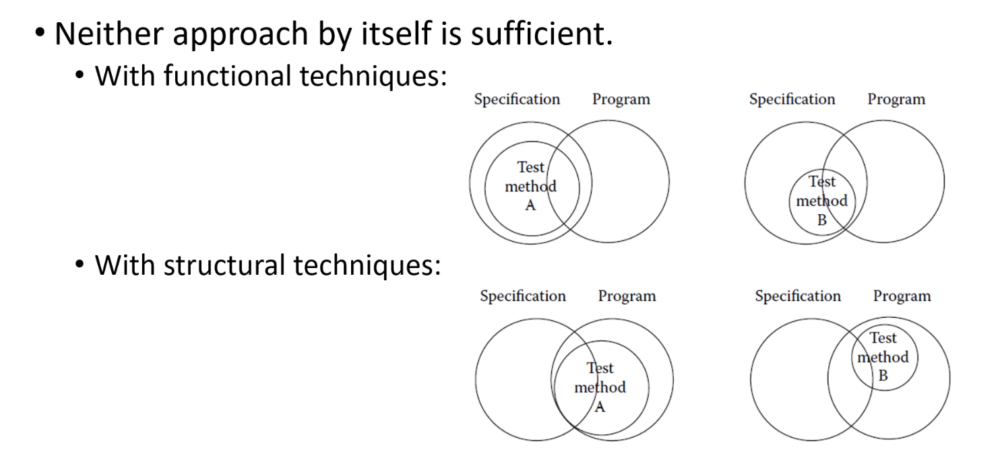

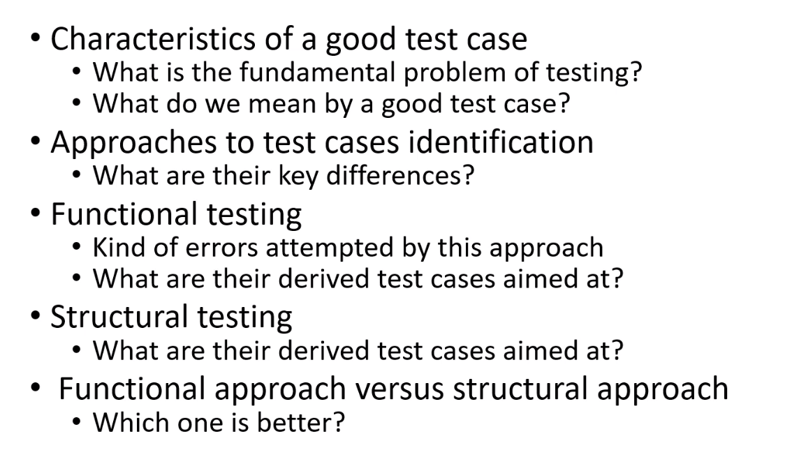
